# Lab 1: Setup Hybrid Identity with On-Prem AD and Entra ID

## Lab Overview 
This lab focuses on setting up a hybrid identity solution using on-premises Active Directory (AD) and Microsoft Entra ID. It guides users through the process of configuring Active Directory on a Windows Server, adding users/groups to the domain controller, and configuring directory synchronization with Microsoft Entra Connect to sync identities between on-premises AD and Entra ID.

## Lab Scenario
In this lab scenario, you are tasked with setting up a hybrid identity solution to seamlessly manage user identities across on-premises and cloud environments. By configuring Active Directory on a Windows Server, adding users/groups, and setting up directory synchronization with Microsoft Entra Connect, organizations can achieve centralized identity management and enable single sign-on capabilities for their users.

## Lab objectives
In this lab, you will perform the following:

- Task 1: Active Directory Setup
- Task 2: Adding users or groups in your Domain Controller
- Task 3: Configure directory synchronization with Entra ID Connect
- Task 4: Verify synchronization in Entra ID

## Estimated timing: 90 minutes

## Architecture Diagram

  

## Task 1: Active Directory Setup
In this task, you will set up Active Directory Domain Services on a Windows Server. This involves launching Server Manager, adding roles and features, selecting Active Directory Domain Services, and promoting the server to a domain controller. By completing this task, you will establish the foundation for managing users, groups, and other objects within your domain.

1. Select the **Start (1)** icon, and then choose **Server Manager (2)** from the menu.
 
    
 
1. In **Server Manager**, select **Manage (1)**, and then choose **Add Roles and Features (2)**.

    
   
1. On the **Before you begin** page, select **Next**.

    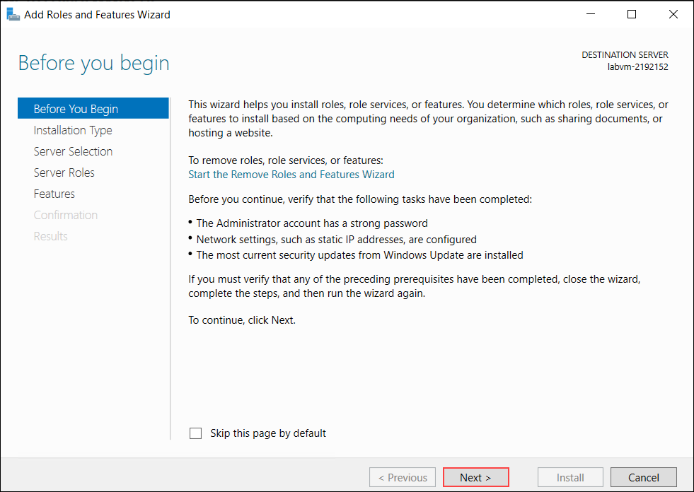  
 
1. On the **Installation Type** page, select **Role-based or feature-based installation (1)**, and then click **Next (2)**.

   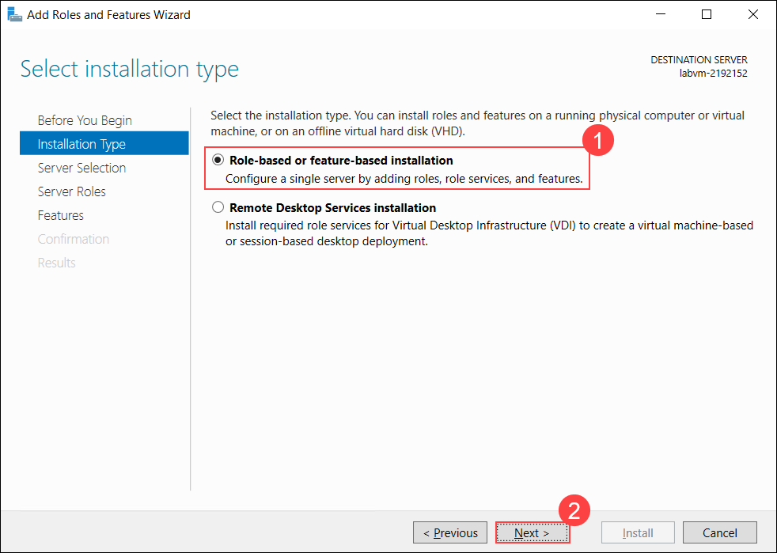
   
1. On the **Server Selection** page, select **Select a server from the server pool (1)**, choose the server, and then click **Next (2)**.

   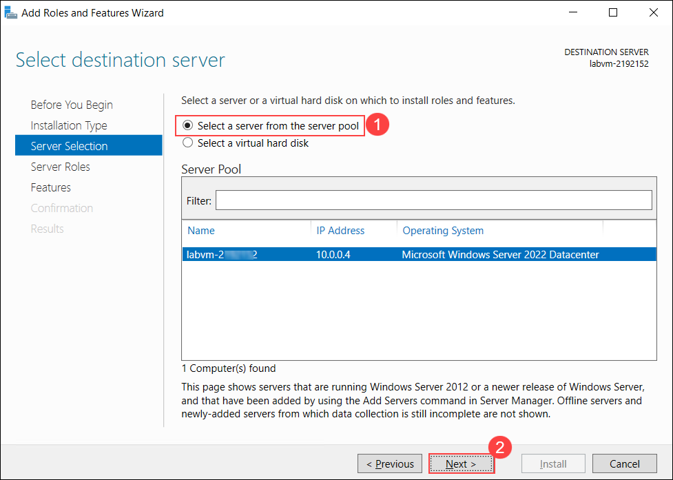
   
1. On the **Server Roles** page, select **Active Directory Domain Services (1)**, and in the pop-up, click **Add Features (2)**.

   

1. On the **Server Roles** page, click **Next**.

   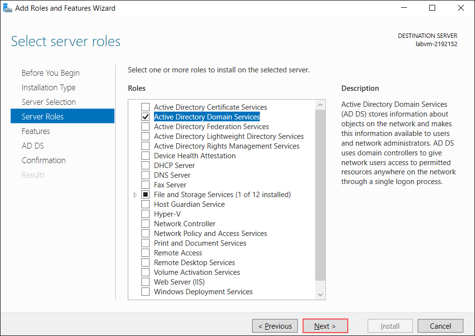
   
1. On the **Features** page, click **Next** without making modifications to any other settings.

   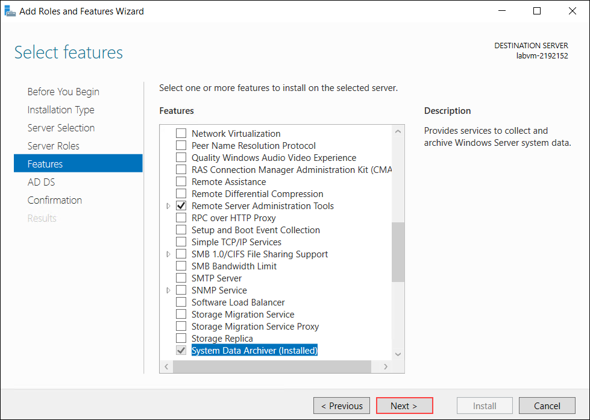 
  
1. You will be redirected to the adding **Active Directory Domain Services** feature once the previous step is complete. On the installer wizard window, click **Next**.

   

1. On the **Confirmation** page, review the selected options, and then click **Install**.

   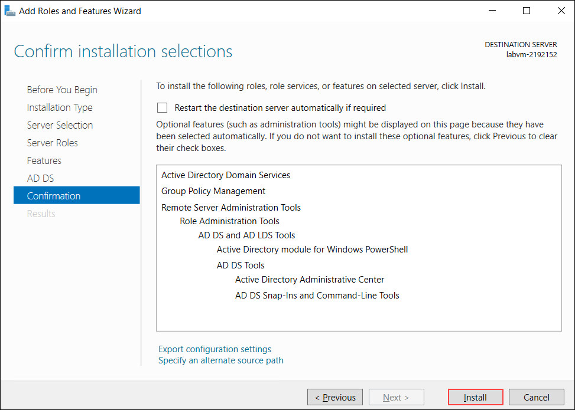

   > **Note:** If you need to make changes, click **Previous** to go back and update the settings, and once confirmed, click **Install** on the **Confirmation** page.
  
1. The wizard will then begin installation. The time of install depends on your machine’s hardware configuration and what features you’ve selected to be installed. Please make sure not to interrupt the installation. Once the installation is complete, click the **Close** button.

  
1. Relaunch **Server Manager** if you have already closed it. On your Server Manager dashboard, you’ll should see a yellow triangle warning sign on the top right of the window near the menu bar. This sign appears only if Active Directory Domain Services was properly installed.

       
1. Click on the warning sign and a dropdown list will show you the required actions termed **post-deployment configuration**.
   
1. Look for the **Promote this server to a domain controller** option and click on it.

   

1. On the **Deployment Configuration** page, select **Add a new forest (1)**, enter the root domain name using the provided value **(2)**, and then click **Next (3)**.

   ```
   Contoso.local
   ```

   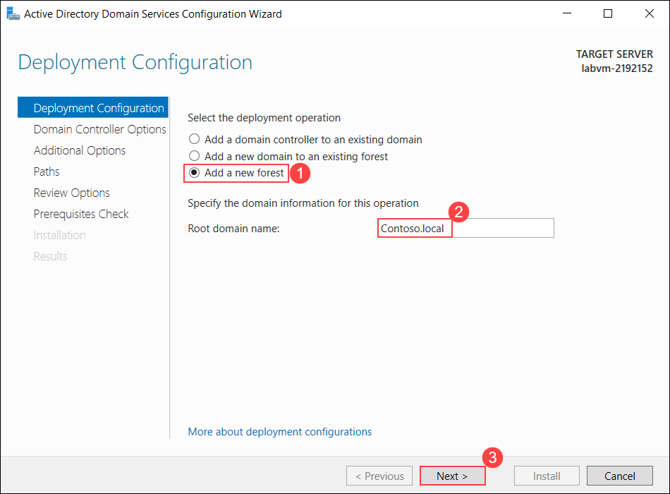 

1. On the **Domain Controller Options** page, keep the default settings, enter and confirm a password of your choice **(1)**, ensure you save this password for future use, and then click **Next (2)**.

   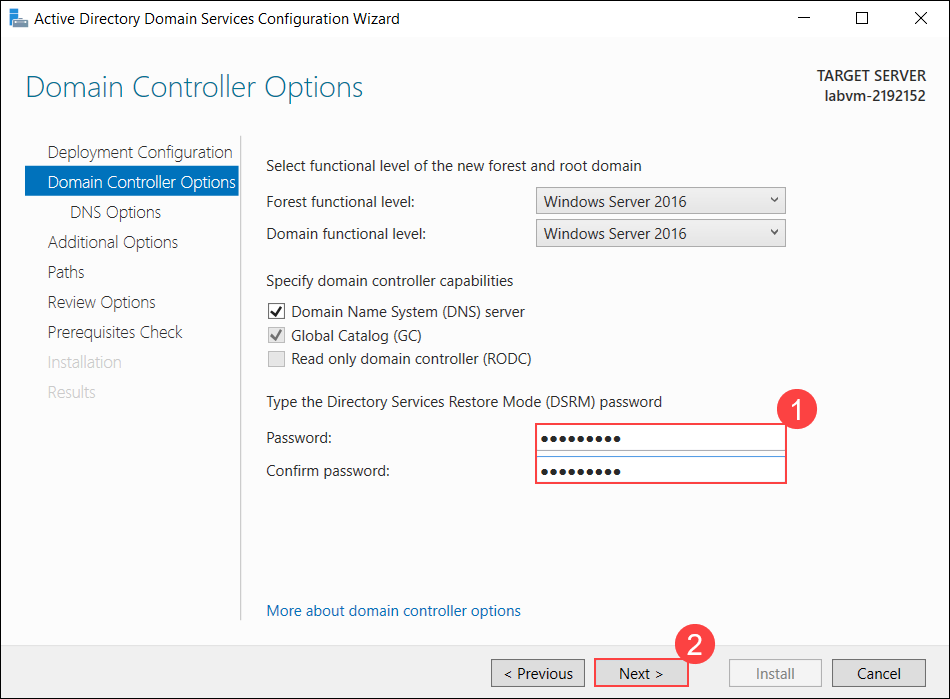

   > **Note:** Make sure to keep a note of this password as changing it later on is troublesome.
 
1. On the **DNS Options** page, ignore the warning message, leave the default settings unchanged, and then click **Next**.

   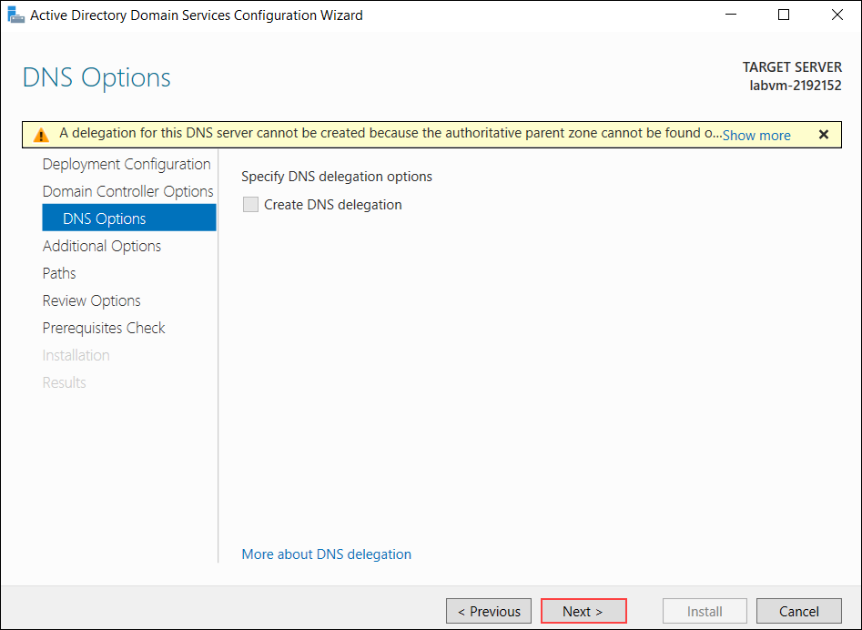

1. On the **Additional Options** page, keep the default NetBIOS name unchanged, and then click **Next**.

   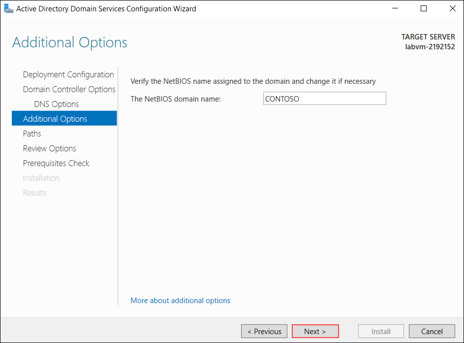

1. On the **Paths** page, leave the default paths unchanged, and then click **Next**.

   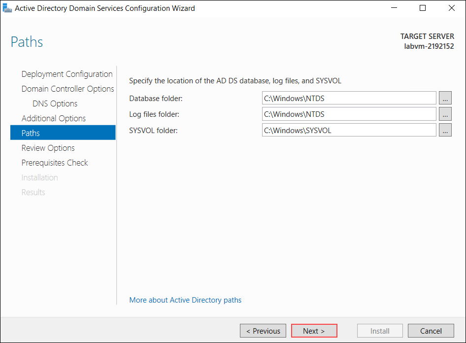

1. On the **Review Options** page, review the selected configuration, and then click **Next**.

   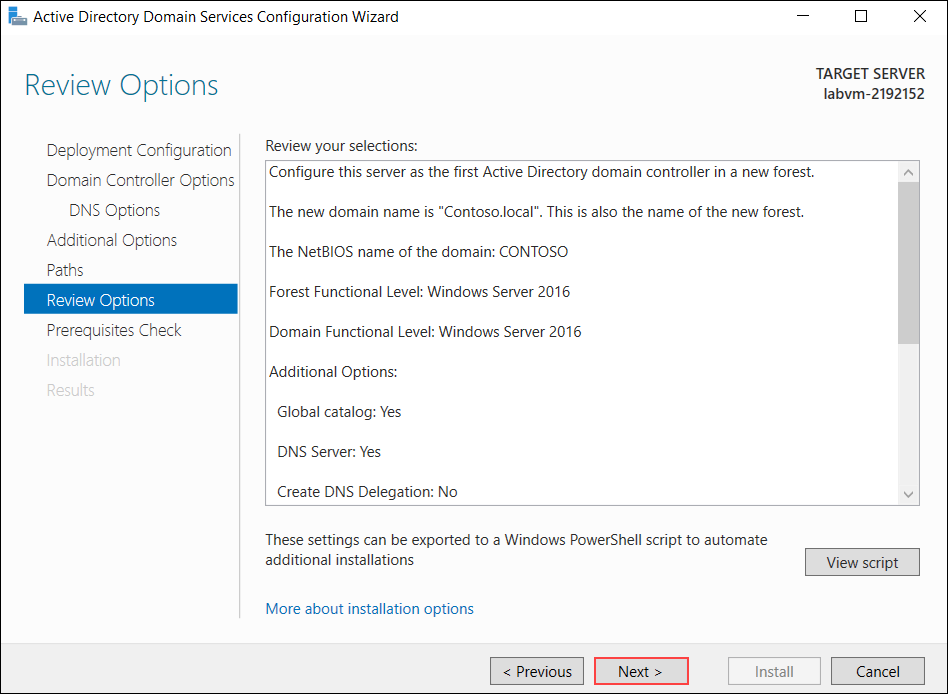

   > **Note:** Review the selected options carefully, use **Previous** to make any changes if required, and once satisfied, click **Next** on the **Review Options** page.

1. On the **Prerequisites Check** page, at this stage verify whether all prerequisite checks are completed successfully, if not review the listed errors and return to the required checkpoint to fix them, and once successful, click **Install**.

   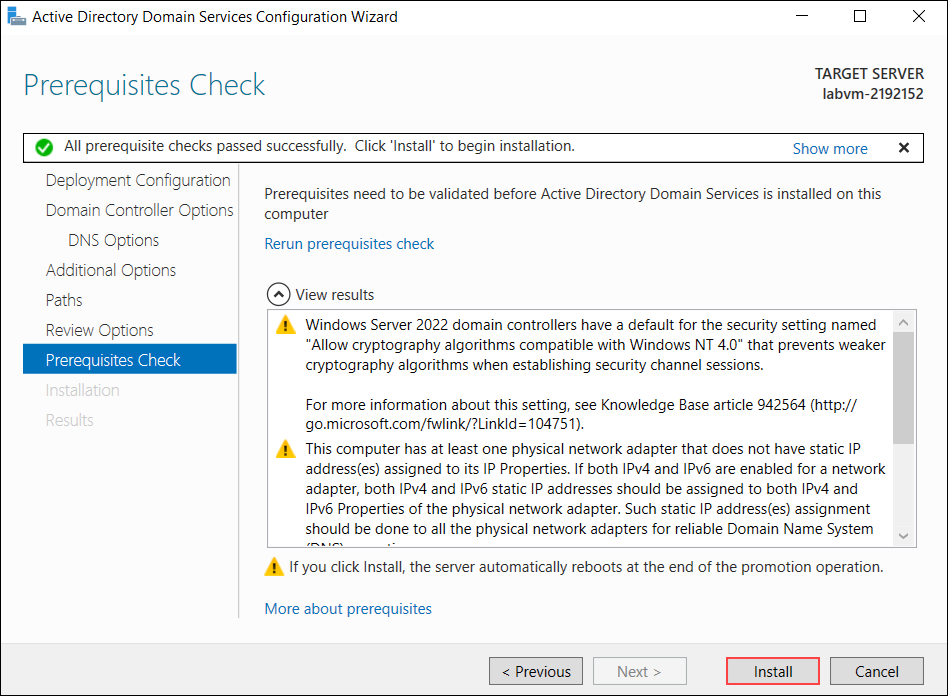

1. Congratulations! You have successfully set up Active Directory on your Windows Server, after the installation completes, the server will restart automatically, and you will temporarily lose access to the LabVM until the restart is finished.

## Task 2: Adding users or groups in your Domain Controller
In this task, you will add user accounts to the domain controller in Active Directory Users and Computers. You will create new user accounts with specified names, usernames, and passwords. By adding users to the domain controller, you will ensure that they have access to resources within the domain and can authenticate against Active Directory.

1. Go to Start > Windows Administrative Tools > Active Directory Users and Computers.

   

1. In a new Desktone hosted Domain controller, Expand the folder which represents the domain and expand and select the **Users** folder then Click **user icon**.

   

1. To create a new user, Click **user icon** and create the users with the following info and click on **Next**.

      | First name           | User logon name          | Password   | 
      | ---------------------| ------------------------ | ---------- |
      | Edmund Reeve         | `ereeve@Contoso.local`   | Pa55-w.rd! |
      | Miranda Snider       | `msnider@Contoso.local`  | Pa55-w.rd! | 
      | Allan Deyoung        | `AllanD@Contoso.local`   | Pa55-w.rd! | 
      | Joni Sherman         | `JoniS@Contoso.local`    | Pa55-w.rd! | 


    
      
1. Please find the below images indicating the user creation process. Make sure to uncheck the **User must change the Password at next logon** setting. Repeat these steps to create all users.
    
    

1. Click on Finish.
   
    

## Task 3: Configure directory synchronization with Microsoft Entra Connect
In this task, you will configure directory synchronization between your on-premises Active Directory and Microsoft Entra ID using Entra Connect. This involves downloading and installing Azure AD Connect, providing necessary credentials for synchronization, and configuring synchronization options. By completing this task, you will enable the seamless synchronization of user identities between on-premises AD and Entra ID.

1. On the taskbar, select **Microsoft Edge**.

1. In the address bar, enter `https://www.microsoft.com/en-us/download/details.aspx?id=47594`.

1. On the Microsoft Entra connect, select **Download**. 

   

1. Select **Open downloads folder** and then in the **Downloads** window, double-click **AzureADConnect.msi**.

1. In the **Microsoft Azure Active Directory Connect** wizard, on the **Welcome to Azure AD Connect** page, select the **I agree to the license terms and privacy notice** check box, and then select **Continue**.

   

1. On the **Express Settings** page, select **Use express settings**.

   

1. On the **Connect to Azure AD** page, in the **USERNAME** and **PASSWORD** boxes, enter **<inject key="AzureAdUserEmail"></inject>**, and your provided password **<inject key="AzureAdUserPassword"></inject>**, and then select **Next**.

   

1. On the **Connect to Azure AD DS** page, in the **USERNAME** and **PASSWORD** boxes, enter **CONTOSO\azureuser**, and your provided password **<inject key="LabVM Admin Password"></inject>**, and then select **Next**.

   

1. On the **Azure AD sign-in configuration** page, select **Continue without matching all UPN suffixes to verified domains** checkbox and then select **Next**.

   

1. On the **Ready to configure** page, ensure that **Start the synchronization process when configuration completes** is selected, and then select **Install**.

   

1. When configuration is complete, select **Exit**.  

   
      > Note: At this time, synchronization of objects from your local Active Directory Domain Services (AD DS) and Azure AD begins. You should wait approximately 3-4 minutes for this process to complete.

1. Close all open windows.

## Task 4: Verify synchronization in Entra ID
In this task, you will verify the synchronization of identities in Azure Active Directory. You will access the Microsoft 365 admin center, navigate to the Identity section, and verify that user accounts synchronized from on-premises AD are visible in Entra ID. By confirming successful synchronization, you will ensure that users can access cloud-based resources using their on-premises credentials.

1. On the taskbar, select **Microsoft Edge**.

1. In the address bar, enter **https://admin.microsoft.com**.

1. At the Sign-in prompt, enter **<inject key="AzureAdUserEmail"></inject>** and then select **Next**.

1. At the Enter password page, enter the password for the Admin account as **<inject key="AzureAdUserPassword"></inject>** and then select **Sign in**. 

1. At the Action required prompt, select **Ask later**.

1. At the Stay signed in prompt, select **No**. The Microsoft 365 admin center opens.

1. Select the **Navigation menu** and then select **Show all**.

1. In the Navigation pane, under **Admin centers** select **Identity**. The Microsoft Entra admin center opens.

1. In the Microsoft Entra admin center, in the navigation pane, select **Users** > **All users**. 

   

1. Close Microsoft Edge.

<validation step="88f54cf4-f08e-43d1-ae62-4372fa096ded" />

> **Congratulations** on completing the task! Now, it's time to validate it. Here are the steps:
> - Click the Lab Validation tab located at the upper right corner of the lab guide section and navigate to the Lab Validation Page.
> - Hit the Validate button for the corresponding task. If you receive a success message, you can proceed to the next task. 
> - If not, carefully read the error message and retry the step, following the instructions in the lab guide.
> - If you need any assistance, please contact us at labs-support@spektrasystems.com. We are available 24/7 to help you out.

**Results**: After completing this exercise, you will have successfully configured Azure AD Connect to synchronize identity from Active Directory Domain Services to Azure Active Directory.

## Summary 
In this lab, you successfully set up a hybrid identity solution by integrating on-premises Active Directory with Microsoft Entra ID. You configured AD Domain Services on a Windows Server, added users to your domain controller, and established directory synchronization using Microsoft Entra Connect. Finally, you verified that the user identities were synchronized correctly, ensuring seamless access across both on-premises and cloud environments. This setup enables centralized identity management and supports single sign-on, enhancing security and user experience in a hybrid IT environment.

## Review
In this lab, you have completed:

- Active Directory Setup
- Adding users or groups in your Domain Controller
- Configure directory synchronization with Entra ID Connect
- Verify synchronization in Entra ID

## You have successfully completed this lab.
