# Lab 01: Setup Hybrid Identity with On-Prem AD and Entra ID

#### Estimated Duration: 60 Minutes

## Overview 

This lab focuses on setting up a hybrid identity solution using on-premises Active Directory (AD) and Microsoft Entra ID. It guides users through the process of configuring Active Directory on a Windows Server, adding users/groups to the domain controller, and configuring directory synchronization with Microsoft Entra Connect to sync identities between on-premises AD and Microsoft Entra.

## Objectives

In this lab, you will perform the following:
- Task 1: Active Directory Setup
- Task 2: Adding users or groups in your Domain Controller
- Task 3: Configure directory synchronization with Microsoft Entra Connect
- Task 4: Verify synchronization in Microsoft Entra 

### Task 1: Active Directory Setup
In this task, you will set up Active Directory Domain Services on a Windows Server. This involves launching Server Manager, adding roles and features, selecting Active Directory Domain Services, and promoting the server to a domain controller. By completing this task, you will establish the foundation for managing users, groups, and other objects within your domain.

1. In the LabVM, click on **Start (1)** and search for **Server Manager (2)**. An application should show up on the list. Click on it to launch the program.
 
    
 
1. Look for **Manage (1)** on the top right of the menu bar. Click on it and then select **Add Roles and Features (2)**. A pop-up window will open immediately. This pop-up window is the installer wizard that guides you through the roles and features setup.

    
   
1. On the left side of the window, you will see a list of all the checkpoints you encounter in this stage. Click **Next** to proceed.

      
 
1. On the **Installation Type** checkpoint, select **Role-based or feature based installation (1)** radio button and then click **Next (2)**.

   
   
1. On the **Server Selection** checkpoint, select a **server from the server pool (1)** radio button. This lists a server installed on your machine. Please click on the desired server once to select it and click **Next (2)**.

   
   
1. On the **Server Roles** checkpoint, in the centre of the window, there is a list of all the roles that you can assign to your server machine. Select **Active Directory Domain Services (1)**. A pop-up window will be displayed. This is the checkpoint for adding new features. Click on the **Add features (2)** button at the bottom of the window, and then click on **Next**.

   
   
1. On the **Features** checkpoint, simply click **Next** without making modifications to any other settings.

    
  
1. You will be redirected to the adding **Active Directory Domain Services** feature once the previous step is complete. On the installer wizard window, click **Next**.

   
    
1. You will see a summary of your selected options here. Have a look at them carefully and if you think you have made a mistake at any of the earlier checkpoints, you can go back and fix it by clicking **< Previous**. Then, click the **Install** button once you are satisfied with your selections at the **Confirmation** checkpoint.

    
  
1. The wizard will then begin installation. The time of installation depends on your machine’s hardware configuration and what features you have selected to be installed. Please make sure not to interrupt the installation. Once you get the message **Configuration required. Installation succeeded on labvm-<inject key="DeploymentID" enableCopy="false"/>**, click on **Close** button.

   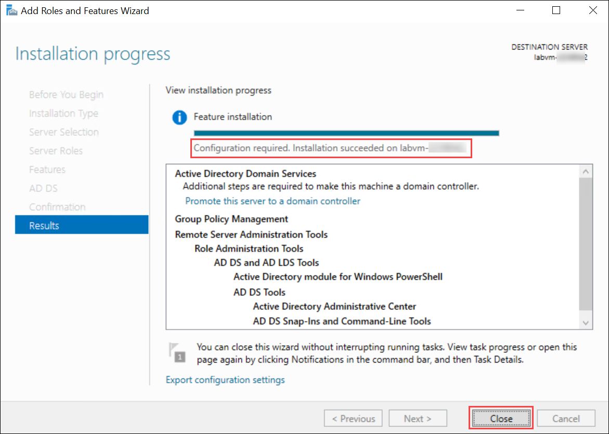
   >**Note:** The installation may take around 2-3 minutes to complete. 
  
1. On the **Server Manager** dashboard, you should see a yellow triangle warning sign on the top right of the window near the menu bar. This sign appears only if Active Directory Domain Services was properly installed.

       
1. Click on the warning sign, and a dropdown list will show you the required actions termed **post-deployment configuration**.
   
1. Look for the **Promote this server to a domain controller** option and click on it.

   
 
1. On the first checkpoint **Deployment Configuration**, please select the **Add a new forest (1)** radio button and enter your root domain name as **Contoso.local (2)**. Then click **Next (3)**.

   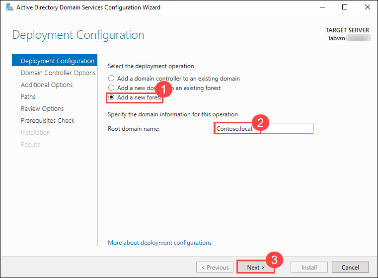 

1. On the **Domain Controller Options** checkpoint, leave all the settings untouched and enter your desired password in the **Directory Services Restore Mode (DSRM) password** and **Confirm password** **(1)** textboxes. Then click **Next (2)**.

   >**Note:** Make sure to keep a note of this password, as changing it later on is troublesome.

   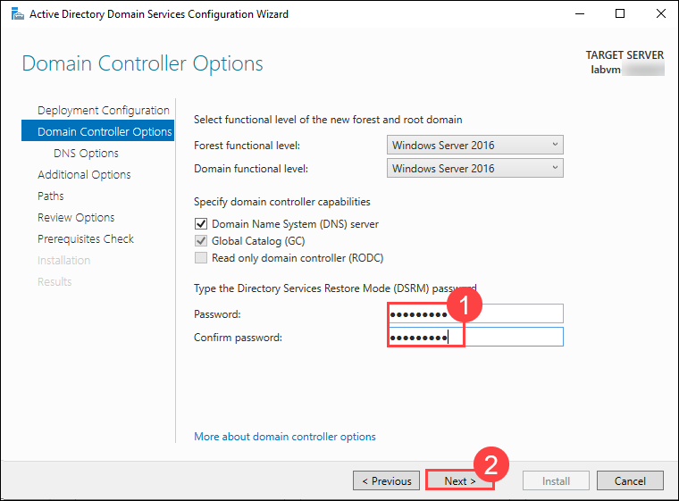
 
1. On the **DNS Options** checkpoint, you will see an error message stating that there’s no parent zone found, and no delegation for your DNS server could be created. Ignore this message and click the **Next** button, leaving all the settings at this checkpoint unchanged.

   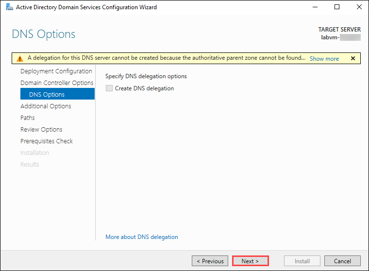

1. On the **Additional Options** checkpoint, enter **CONTOSO (1)** on the `NetBIOS domain name` textbox. Then click **Next (2)**.

   

1. Three or more paths will be listed on your screen. Do not change these paths. You are not required to keep a note of these paths either. Click **Next**.

   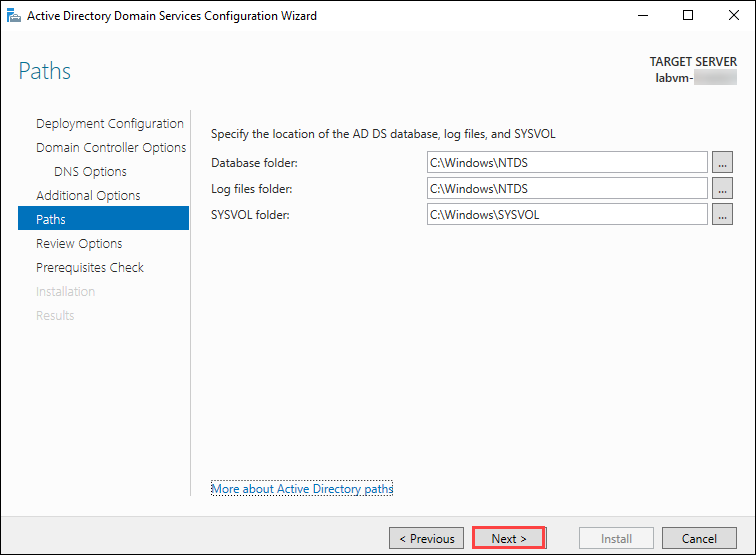

1. Whatever options you have selected so far will be listed on the configuration wizard at the **Review Options** checkpoint. Have a look at them and if needed, move to the previous checkpoints using the **< Previous** button and make the desired changes. Once you’re satisfied with the selected options, click **Next**.

   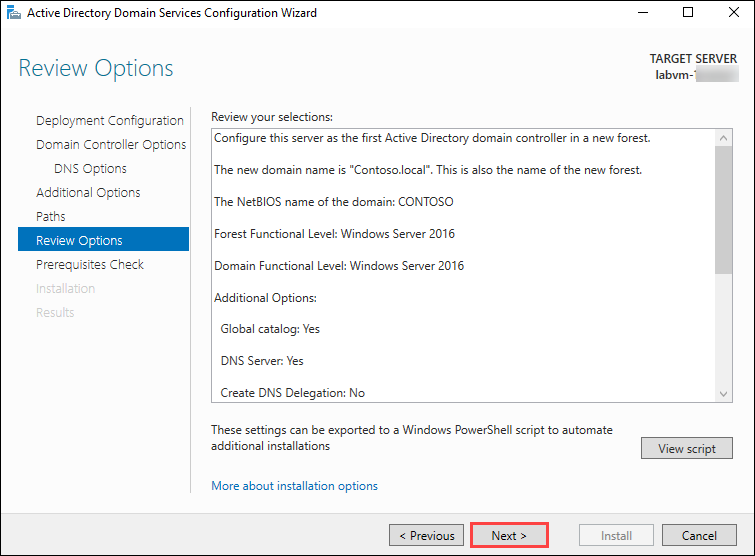

1. Next, head to the **Prerequisites Check** checkpoint. At this stage, you will see if all the prerequisite checks were completed. If not, then a list of errors will be displayed in the window. If there are any errors, you will need to go to the stated checkpoint and fix the errors. Once you have fixed all the errors, a green check mark with a success message will be displayed. Then click **Install** to begin the installation.

   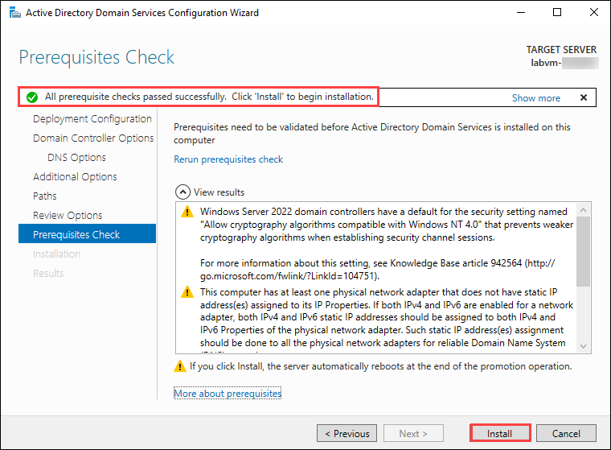

1. Once the installation is completed, your LabVM will automatically restart. 

   >**Note**: Wait for 2-3 minutes and then click on "Reconnect" to connect to the LabVM.

### Task 2: Adding users or groups in your Domain Controller

In this task, you will add user accounts to the domain controller in Active Directory Users and Computers. You will create new user accounts with specified names, usernames, and passwords. By adding users to the domain controller, you will ensure that they have access to resources within the domain and can authenticate against Active Directory.

1. In your LabVM, go to **Start (1)** and click on **Windows Administrative Tools (2)**. Then double-click on **Active Directory Users and Computers (3)**.

   

1. In the **Active Directory Users and Computers** console, on the left pane, you will see a hierarchical structure of your domain. This structure represents the organization of your Active Directory environment. 

1. Expand the folder that represents the **Contoso.local (1)** domain and click on **Users (2)** folder. This is where you will create new user accounts for your domain. Click on the **New User (3)** icon to create a new user account.

   

1. Enter the following to create the users listed below: 

      | Name           | User Name                | Password   | 
      | -------------- | ------------------------ | ---------- |
      | Edmund Reeve   | `ereeve@Contoso.local`   | Pa55-w.rd! |
      | Miranda Snider | `msnider@Contoso.local`  | Pa55-w.rd! | 
      | Allan Deyoung  | `AllanD@Contoso.local`   | Pa55-w.rd! | 
      | Joni Sherman   | `JoniS@Contoso.local`    | Pa55-w.rd! | 

1. Please find the images below indicating the user creation process. Repeat these steps to create all users.
    
   >**Note:** Make sure to uncheck the **User must change the Password at next logon** setting

    
  
    
  
    

1. Similarly, create the other users as well. 

### Task 3: Configure directory synchronization with Microsoft Entra Connect

In this task, you will configure directory synchronization between your on-premises Active Directory and Azure Active Directory using Microsoft Entra Connect. This involves downloading and installing Microsoft Entra Connect, providing necessary credentials for synchronization, and configuring synchronization options. By completing this task, you will enable the seamless synchronization of user identities between on-premises AD and Microsoft Entra.

1. In your Lab VM, open the Microsoft Edge browser and navigate to the below link.

   ```
   https://entra.microsoft.com/#view/Microsoft_AAD_Connect_Provisioning/AADConnectMenuBlade/%7E/GetStarted
   ```

   >**Note:** Log in with the credentials provided in the **Environment** tab if you are not logged in already. 

1. You will be navigated to **Microsoft Entra Connect** page, click on **Manage** 

   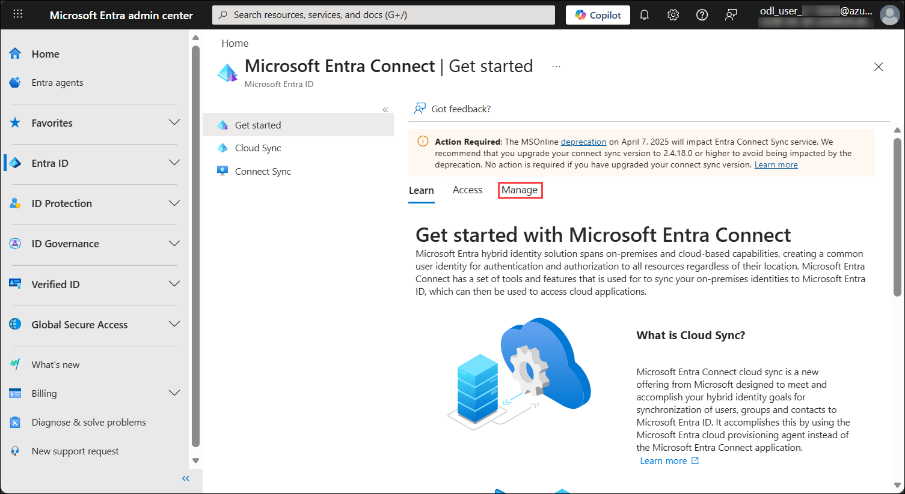

1. Scroll down and click on **Download Connect Sync Agent** on the Manage tab. 

   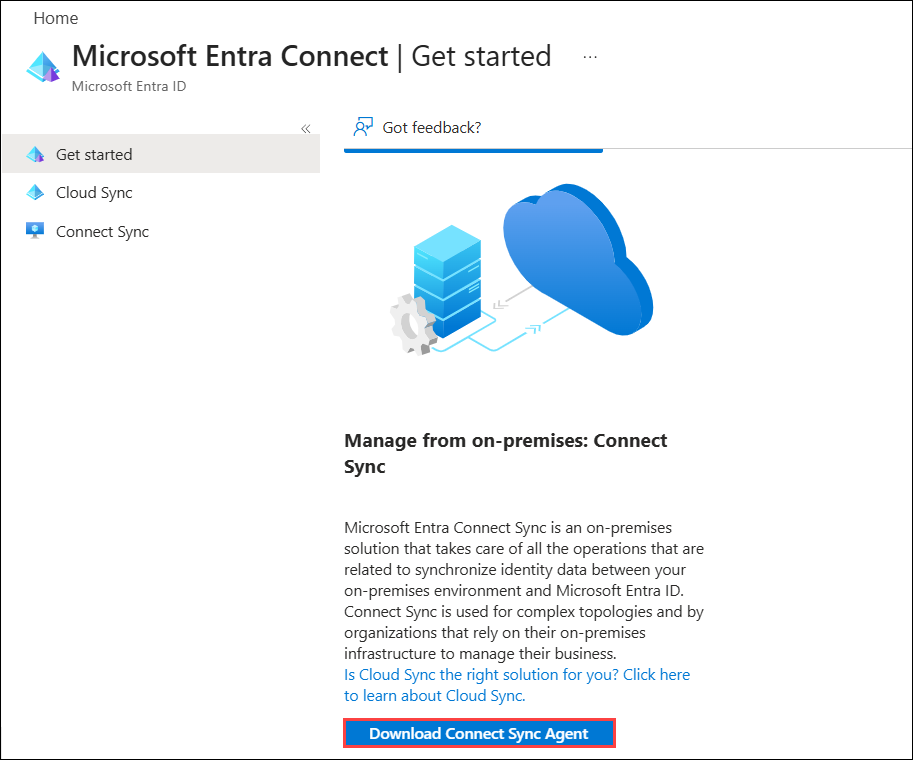
   >**Note**: Please make sure that you have clicked on the **Download Connect Sync Agent** option

1. Click on **Accept terms & download**

   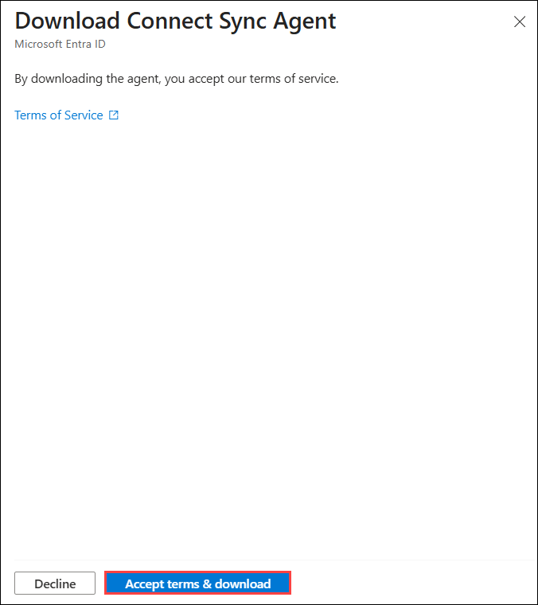

1. Select **Open downloads folder** and then in the **Downloads** window, double-click **AzureADConnect.msi**.

   >**Note:** If you receive an error while downloading the file that states Smart screen prevented the download, please click on the three dots next to the file in the downloads bar and select **Keep**. 

1. In the **Microsoft Entra Connect Sync** wizard, on the **Welcome to Microsoft Entra Connect Sync** page, select the **I agree to the license terms and privacy notice (1)** check box, and then select **Continue (2)**.

   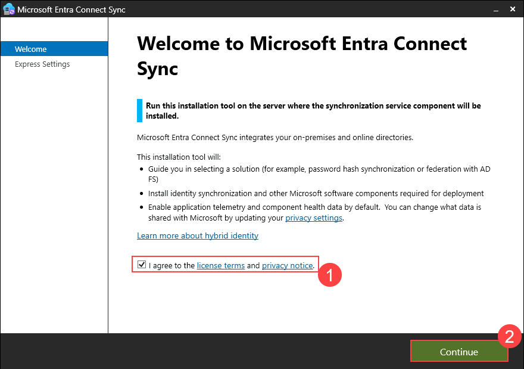

1. On the **Express Settings** page, select **Use express settings**.

   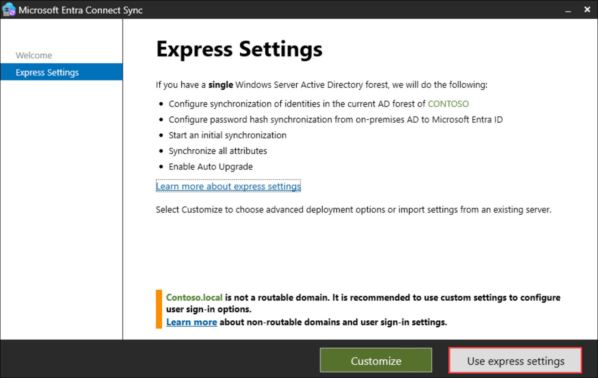

1. On the **Connect to Microsoft Entra ID** page, in the **USERNAME** box, enter **<inject key="AzureAdUserEmail"></inject> (1)** and then select **Next (2)**.

   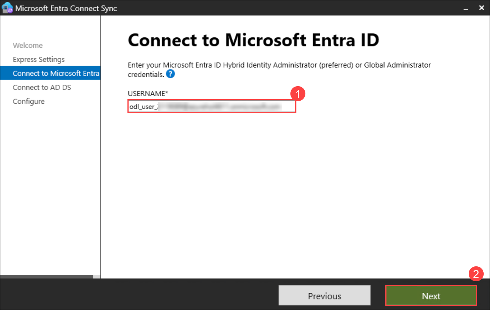

1. You will be navigated to a pop-up for signing in to a Microsoft Account. 

   - Enter UserName/Email: **<inject key="AzureAdUserEmail"></inject>** and click on **Next**.

      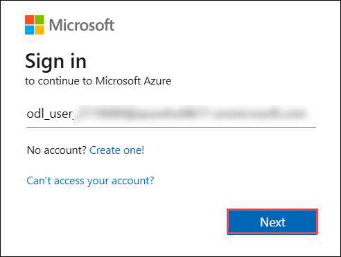

   - Enter Temporary Access Pass: **<inject key="AzureAdUserPassword"></inject>** and click on **Sign in**.
   
      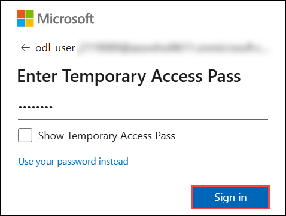

1. On the **Connect to AD DS** page, in the **USERNAME** box, enter **CONTOSO\azureuser (1)**, and password as **<inject key="LabVM Admin Password"></inject> (2)**, and then select **Next (3)**.

   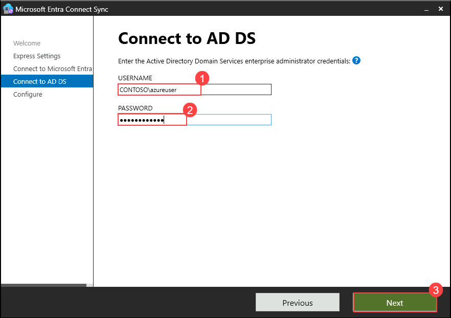

1. On the **Microsoft Entra sign-in configuration** page, check the **Continue without matching all UPN suffixes to verified domains (1)** checkbox and then select **Next (2)**.

   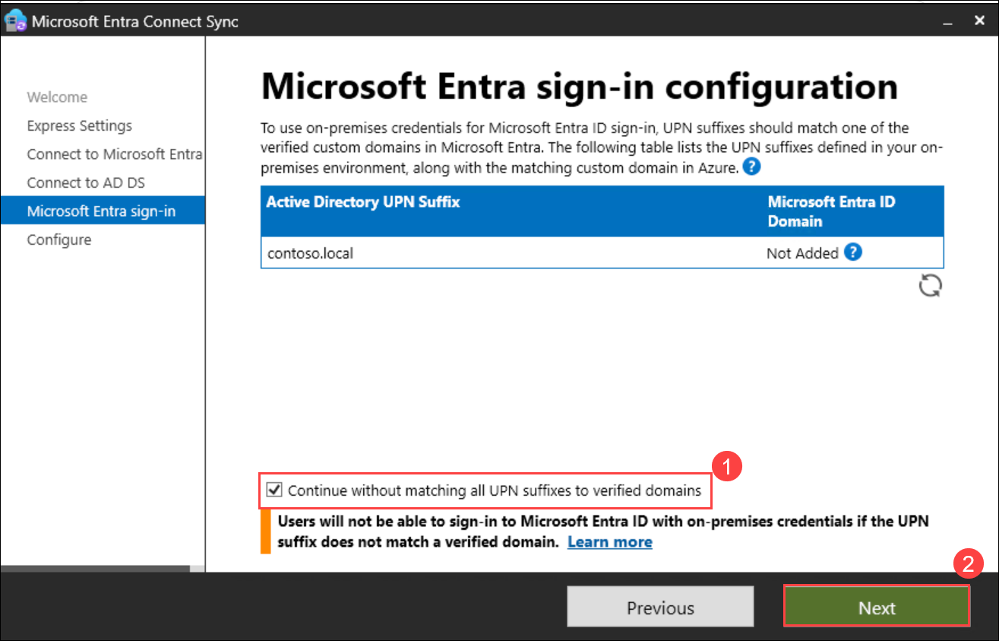

1. On the **Ready to configure** page, ensure that **Start the synchronization process when configuration completes** is selected, and then select **Install**.

   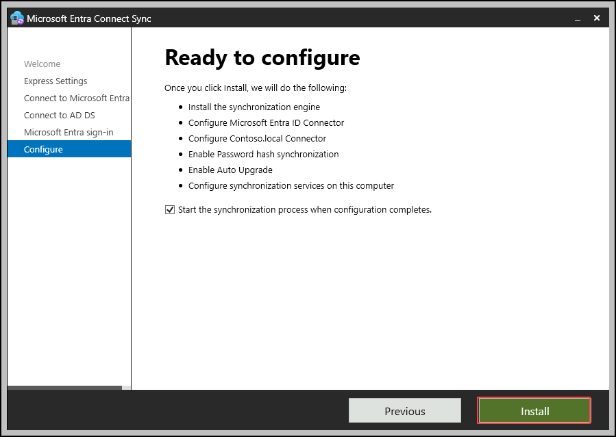

1. When the configuration is completed, select **Exit**.  

   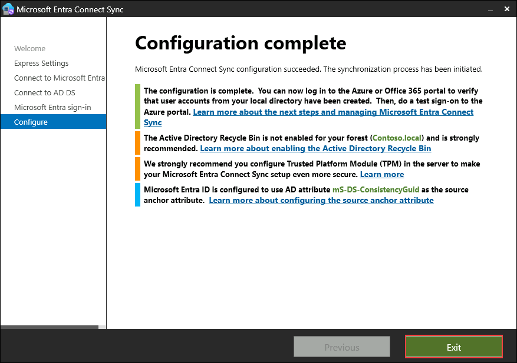
     
   >**Note:** At this time, synchronization of objects from your local Active Directory Domain Services (AD DS) and Microsoft Entra  begins. You should wait approximately 10 minutes for this process to complete.

### Task 4: Verify synchronization in Microsoft Entra

In this task, you will verify the synchronization of identities in Microsoft Entra. You will access the Microsoft 365 admin center, navigate to the Identity section, and verify that user accounts synchronized from on-premises AD are visible in Microsoft Entra. By confirming successful synchronization, you will ensure that users can access cloud-based resources using their on-premises credentials.

1. Open a new tab in **Microsoft Edge** browser in your LabVM, and navigate to Microsoft 365 Admin Center using the following URL:

   ```
   https://admin.microsoft.com
   ```

   >**Note:** If prompted to sign in, enter **<inject key="AzureAdUserEmail"></inject>** and click **Next**.

   > At the password prompt, enter **<inject key="AzureAdUserPassword"></inject>** and click **Sign in**.

1. In the Navigation pane, under **Users (1)** select **Active users (2)**.

   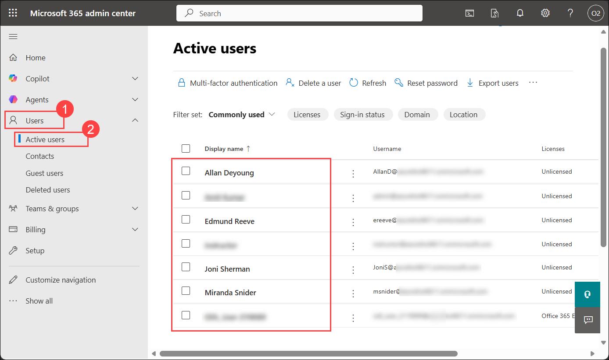

1. On the **Active users** page, you should see the user accounts that you created in your on-premises Active Directory Domain Services (AD DS) environment. This confirms that synchronization between your on-premises AD and Microsoft Entra  was successful.
  
> **Congratulations** on completing the task! Now, it's time to validate it. Here are the steps
> - Scroll down in the lab guide and hit the Validate button for the corresponding task. If you receive a success message, you can proceed to the next task. 
> - If not, carefully read the error message and retry the step, following the instructions in the lab guide.
> - If you need any assistance, please contact us at cloudlabs-support@spektrasystems.com. We are available 24/7 to help you out.

<validation step="ecb2747e-8d27-4fbc-9459-a9bb4a6d5171" />

## Summary 

In this lab, you have set up a hybrid identity solution by configuring on-premises Active Directory and synchronizing it with Microsoft Entra. You have successfully installed Active Directory Domain Services, created user accounts in the domain controller, configured directory synchronization using Microsoft Entra Connect, and verified the synchronization of identities in Microsoft Entra. This foundational setup enables seamless access to resources across both on-premises and cloud environments, providing a unified identity management experience.

#### You have successfully completed the lab. Click on Next >> to proceed with the next lab.
   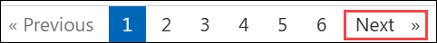
