# Lab 02: Configuring Self-service password reset for user accounts in Entra ID

#### Estimated Duration: 60 Minutes

## Scenario

Contoso Ltd. wants to reduce help desk workload and improve user productivity by enabling users to securely reset their own passwords. As an Identity Administrator, you will configure password writeback in Microsoft Entra Connect, update the on-premises password policy to support password resets, and enable Self-Service Password Reset (SSPR) in Microsoft Entra ID. You will then validate the solution by performing a password reset through the My Account portal and confirming that the password change is synchronized between Microsoft Entra ID and on-premises Active Directory.

## Overview 

This lab focuses on configuring Entra Connect with password writeback, updating the minimum password age policy to 0, enabling self-service password reset with authentication methods via Microsoft Entra Admin Center, and validating by changing a password via My Account page in Microsoft Edge.

## Objectives

In this lab, you will perform the following:
- Task 1: Configure password writeback and Password minimum age policy. 
- Task 2: Enable self-service password reset
- Task 3: Validate self-service password reset

### Task 1: Configure password writeback and Password minimum age policy. 

In this task, you will configure password writeback using Microsoft Entra Connect.

1. Select the **Azure AD Connect (1)** application from the LabVM desktop

1. On the **Welcome to Entra Connect Sync** page, select **Configure (2)**.

   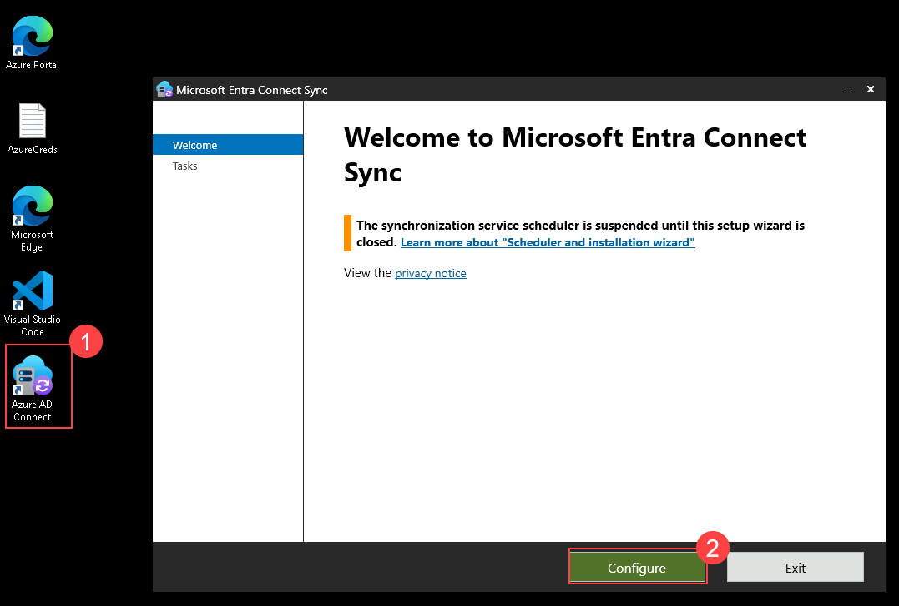

1. On the **Additional tasks** page, select **Customize synchronization options (1)**, and then select **Next (2)**.

   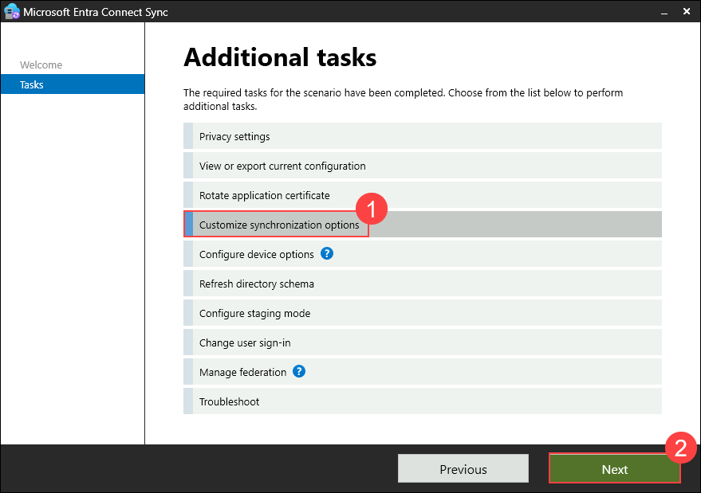

1. On the **Connect to Microsoft Entra ID** page, type **<inject key="AzureAdUserEmail"></inject> (1)** in the **USERNAME** text box and then select **Next (2)**.

   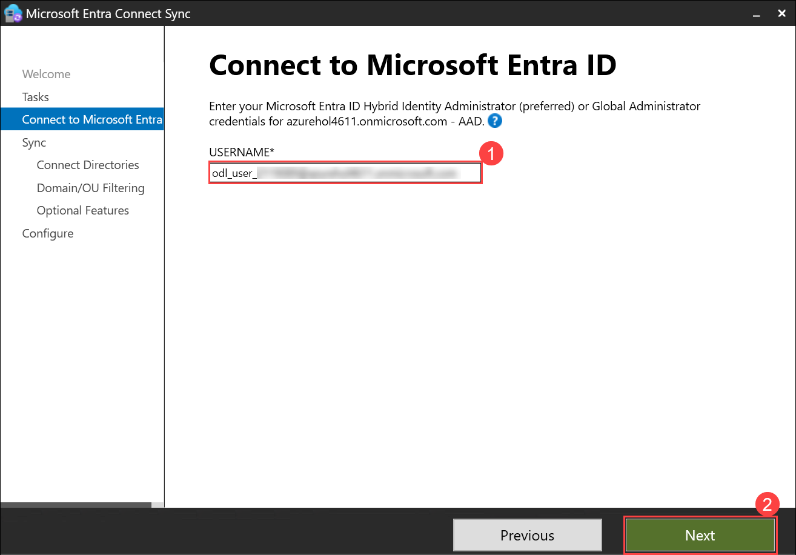

1. Select the **<inject key="AzureAdUserEmail"></inject>** as the username and enter the Temporary Access Pass  **<inject key="AzureAdUserPassword"></inject>** for the password, and then select **Sign in**.

1. On the **Connect your directories** page, select **Next**.

   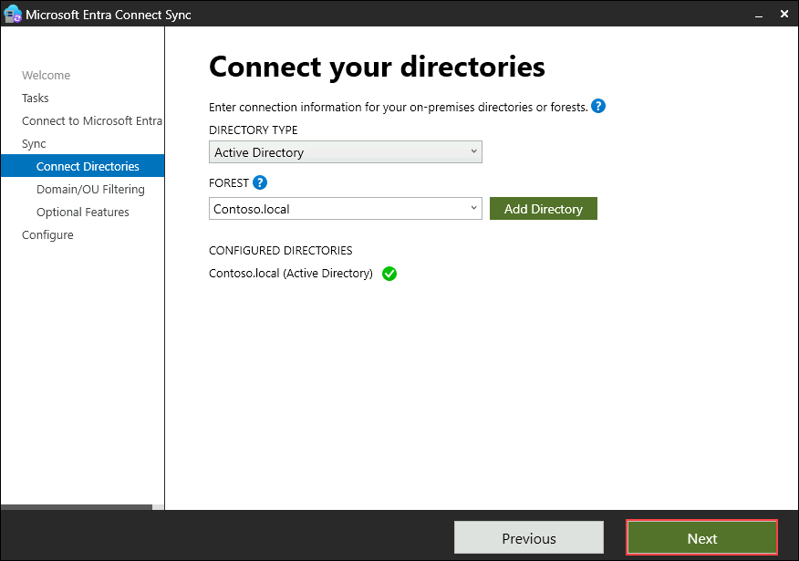

1. On the **Domain and OU filtering** page, select **Next**.

1. On the **Optional features** page, select **Password writeback (1)**, and then select **Next (2)**.

    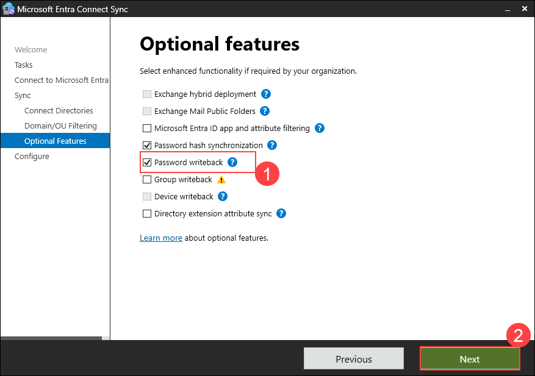

1. On the **Ready to configure** page, select **Configure**.

    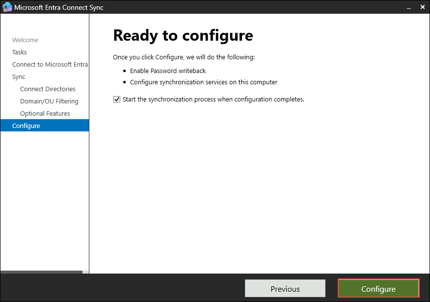

1. When the configuration is completed, select **Exit**.

    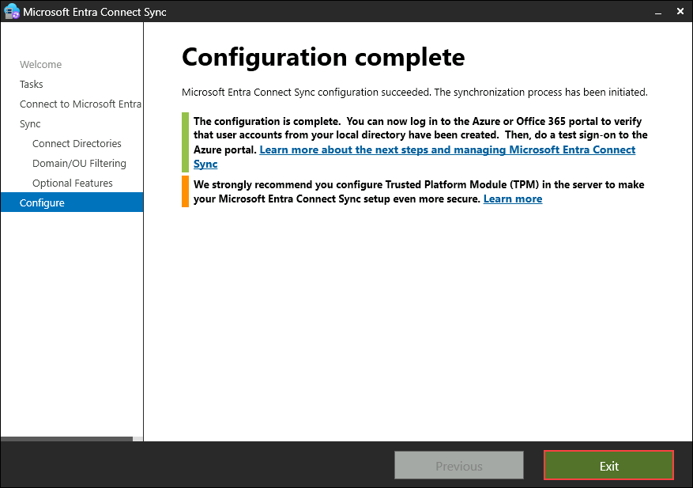

1. Search for **cmd (1)** in the **Start** menu and open **Command Prompt (2)** in your LabVM 

    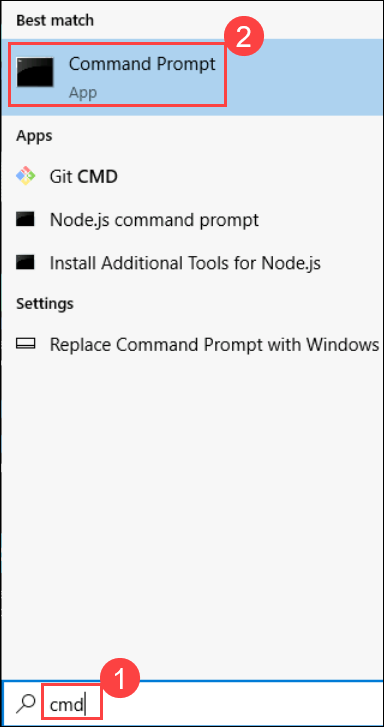

1. Run the below command to update the minimum password age policy to 0.

    ```
    secedit /configure /cfg %windir%\inf\defltbase.inf /db defltbase.sdb /verbose
    ```

1. Once updated, click on the **Start (1)** menu, select **Power (2)** button and then select **Restart (3)** to restart the LabVM.

    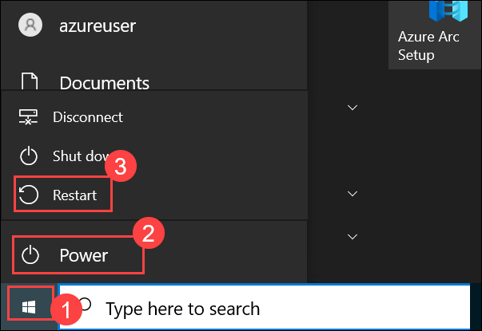

     >**Note**: Wait for 2-3 minutes and then click on "Reconnect" to connect to the LabVM.

1. To verify if the policy is updated, search for **(1)** and select **Local Security Policy (2)** in the **Start** menu 

    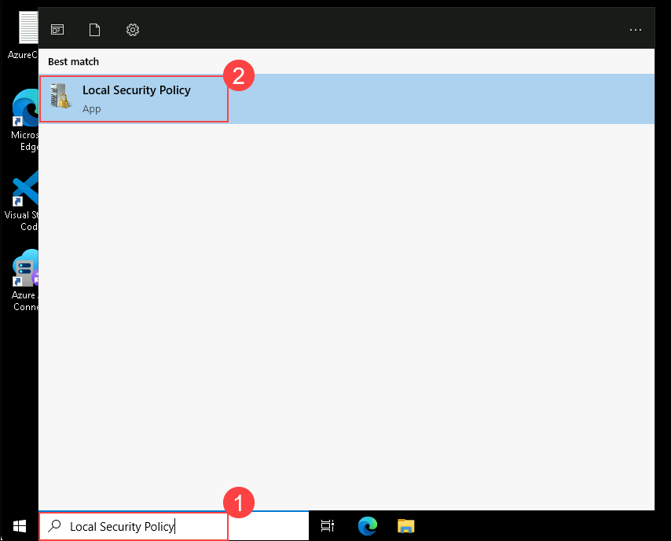

1. Expand **Account Policies (1)**, then select **Password Policy (2)** and verify that **Minimum Password Age (3)** has been set to 0 days.

    

### Task 2: Enable self-service password reset

In this task, you will enable self-service password reset for users in your tenant via Microsoft Entra Admin Center.

1. Open **Microsoft Edge** browser in your LabVM, and navigate to Microsoft Entra Admin Center using the following URL:

    ``` 
    https://entra.microsoft.com/
    ```

1. If prompted, sign in as  **<inject key="AzureAdUserEmail"></inject>**, and use the Temporary Access Pass as **<inject key="AzureAdUserPassword"></inject>**, If the **Stay signed in?** prompt appears, select **No**.  

1. On the **Microsoft Entra admin center**, in the search box, type **Password reset (1)**, and then select **Password reset (2)**.

    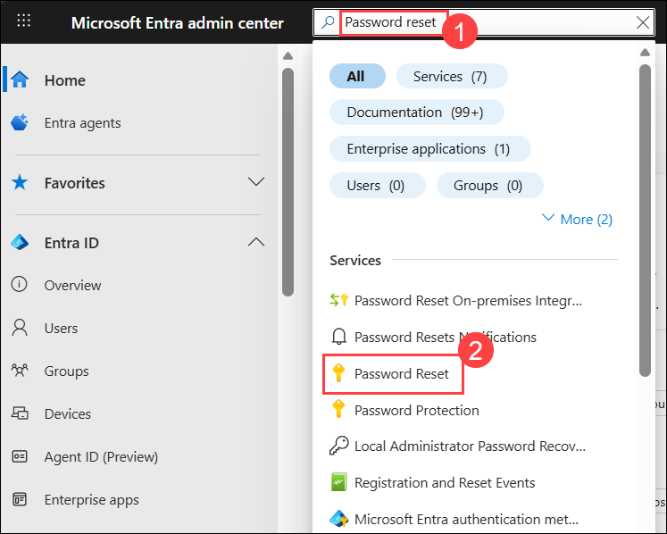

1. In the **Password reset | Properties** window, select **All (1)** to enable self-service password reset to all users. Select **Save (2)**.

    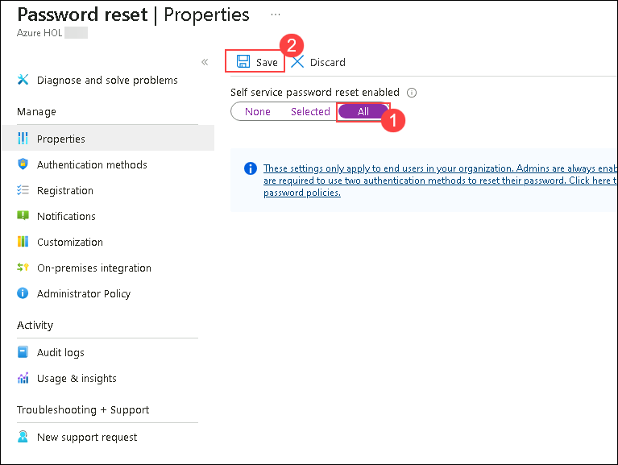
    
    >**Note**: If it already enabled, please continue to next step. If you encounter the error "Failed to save password reset policy – Unexpected error when saving password reset policy" while saving the configuration, please ignore the message and wait a few minutes before trying again. This issue may occur due to temporary backend synchronization or service delays. Retry the action after a short interval until the configuration is successfully applied

1. On the **Password reset | Properties** blade, select **Authentication methods (1)**.

1. For the **Methods available to users**, ensure that **Mobile Phone and Email (2)** are selected, and then select **Security Questions (3)**.

1. For the **Number of questions required to register (4)**, select **3**.

1. For the **Number of questions required to reset (5)**, select **3**. Click on select **No security questions configured (6)**.

    

1. In the **Select security questions** page, select **Predefined (1)**. Select three questions **(2)** of your choice, and then select **Ok (3)**.

    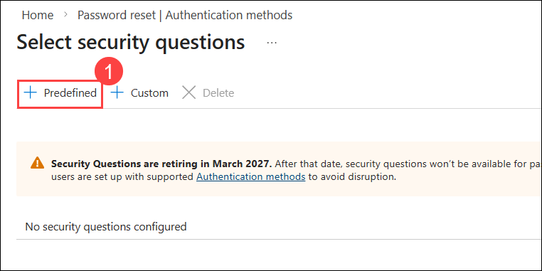

    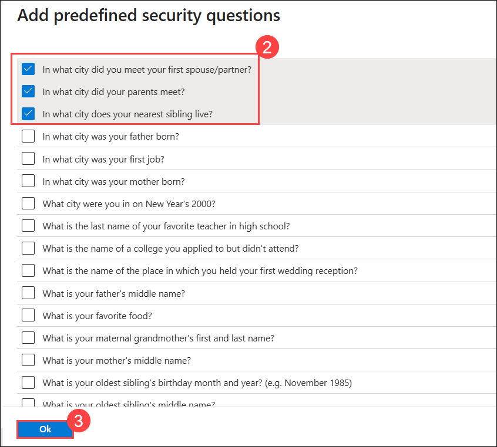

1. Select **Ok**. and click on **Save** to save the settings.

1. Then select **Registration (1)** in the left pane, select **No (2)** for **Require users to register when signing in**, and the select **Save (3)**.

    

1. In the left navigation pane, select **On-premises integration (1)**.

1. Verify that your on-premises writeback client is running and select the checkbox for **Write back passwords with Microsoft Entra Connect cloud sync (2)** and then click **Save (3)**.

    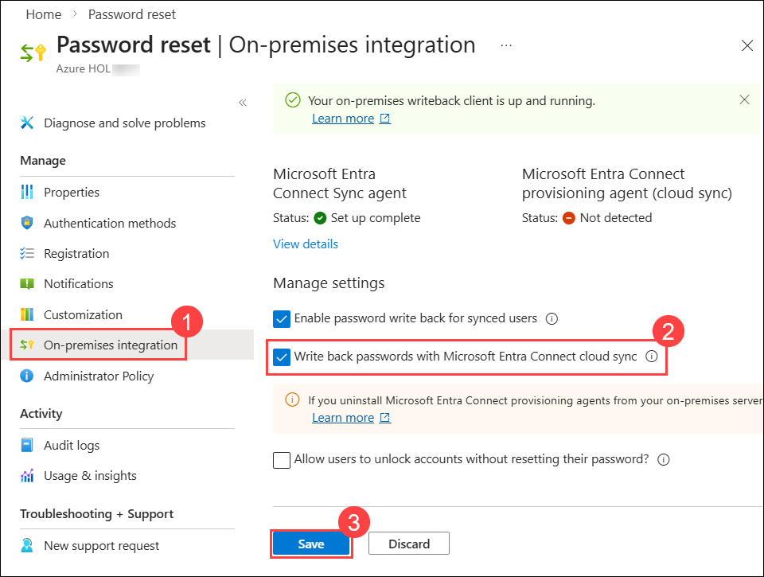

    >**Note**: If it already enabled, please continue to next step

### Task 3: Validate self-service password reset

In this task, you will validate self-service password reset by changing the password via the My Account page.

1. Open a New InPrivate window in Microsoft Edge and navigate to the My Account page using the following URL:

    ```
    https://myaccount.microsoft.com/
    ```

1. On the **Sign in** page, enter **`msnider@xxxxxx.onmicrosoft.com` (1)** and then select **Next (2)**.

    >**Note**: Replace xxxx with the tenant name provided in the lab credentials.

    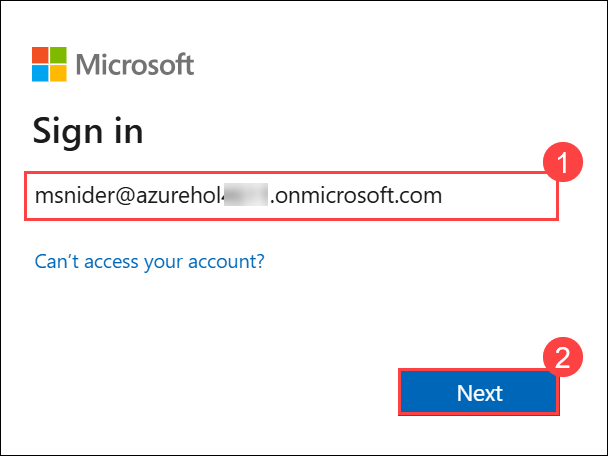

1. On the **Enter password** page, enter **Pa55-w.rd!** or the password that you have entered and then select **Sign in**. 

    > **Note**: If prompted with MFA, please follow the below steps or skip the steps and continue from step 13 if MFA is already enabled.

1. At the **Let's keep your account secure** prompt, select **Next** thrice

1. **Note:** If you don’t have the Microsoft Authenticator app installed on your mobile device:

    - Open **Google Play Store** (Android) or **App Store** (iOS).
    - Search for **Microsoft Authenticator** and tap **Install**.
    - Open the **Microsoft Authenticator** app, select **Add account**, then choose **Work or school account**.

1. A **QR code** will be displayed on your computer screen.

1. In the Authenticator app, select **Scan a QR code** and scan the code displayed on your screen.

1. After scanning, click **Next** to proceed.

1. On your phone, enter the number shown on your computer screen in the Authenticator app and select **Next** and then click on **Done**,
       
1. If prompted to stay signed in, you can click **No**.

1. On the **My Account** page, in the navigation pane, select **Change password**.

    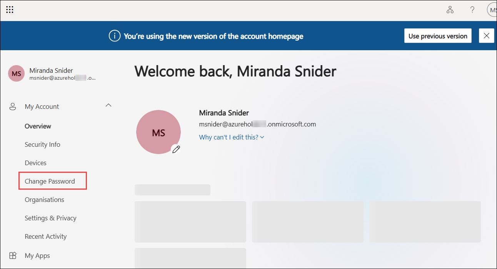

1. On the **Change your password** page, enter the following information and then select **Submit (3)**:

     - New password: **Pa55w.rd!1234 (1)**
     - Confirm new password: **Pa55w.rd!1234 (2)**

        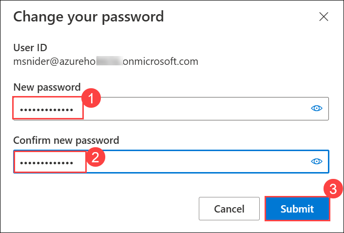

1. On the Success, password changed window, click on **Done**.

1. Once done, close the InPrivate window. 

## Summary

In this lab, you have configured self-service password reset for user accounts in Entra ID. You enabled password writeback using Microsoft Entra Connect, updated the minimum password age policy to allow immediate password changes, and configured self-service password reset options, including authentication methods and registration requirements. Finally, you validated the self-service password reset process by successfully changing a user's password through the My Account page. This setup empowers users to manage their passwords securely and reduces the administrative overhead of password resets.

#### You have successfully completed the lab. Click on Next >> to proceed with the next lab.
   
