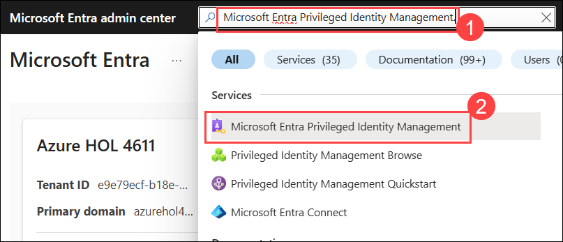
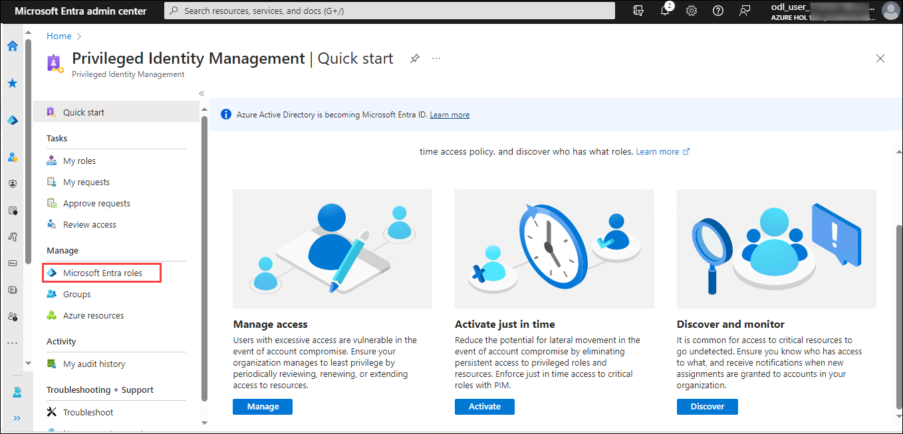
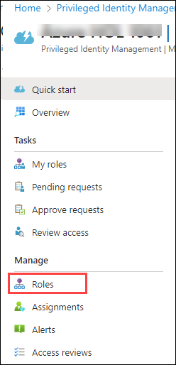
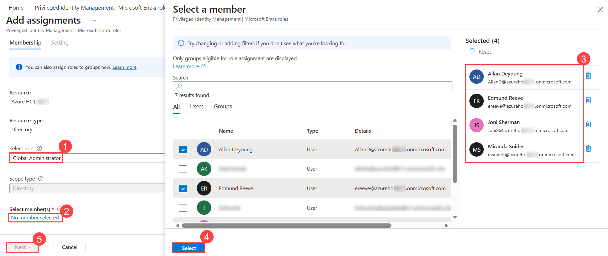
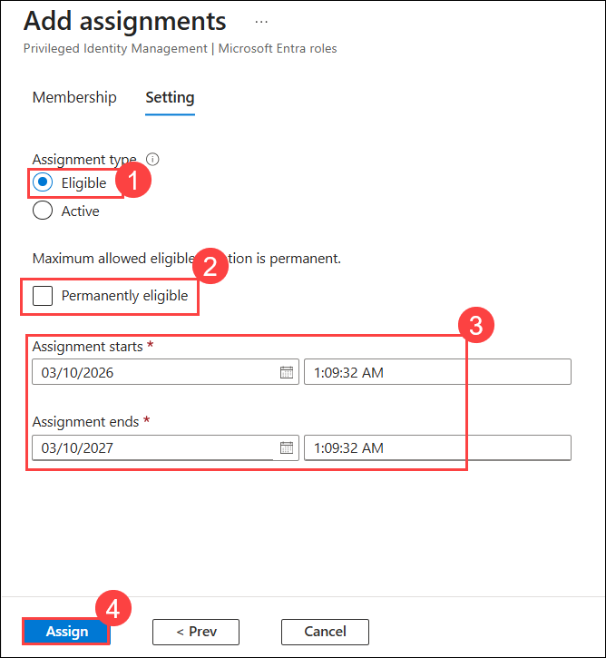
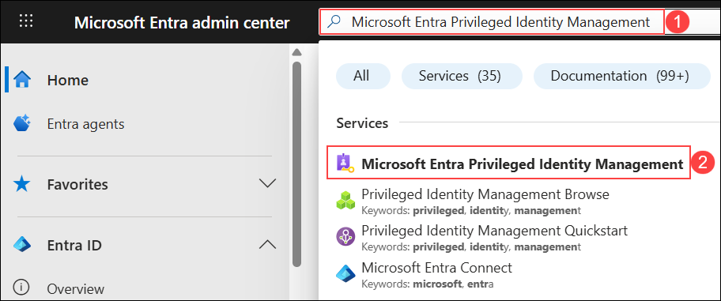
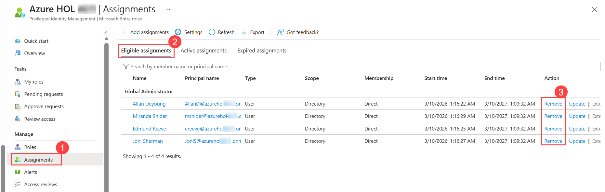
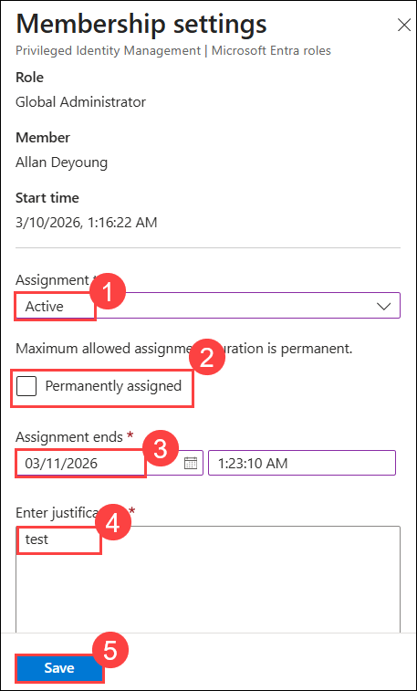

# Lab 03: Implement and use Privileged Identity Management

#### Estimated Duration: 30 Minutes

## Overview

This lab focuses on setting up the use of Microsoft Entra to assign Global Administrator roles to specified users with defined privileges and durations. Then, manage and update existing role assignments, transitioning them from eligible to active status as needed, with specified durations and justifications.

## Objectives

In this lab, you will perform the following:
- Task 1: Assign Azure resource roles
- Task 2: Update or remove an existing Entra role assignment

### Task 1: Assign Azure resource roles

In this task, you will assign the Global Administrator role to the users from the Microsoft Entra portal. 

1. Open a browser tab and sign in to Microsoft Entra Admin Center using your lab credentials. 

    ```
    https://entra.microsoft.com
    ```

   - Username : **<inject key="AzureAdUserEmail"></inject>**
   - Password : **<inject key="AzureAdUserPassword"></inject>**

1. Search **(1)** for and then select **Microsoft Entra Privileged Identity Management (2)**.

    

1. In the Privileged Identity Management page, in the left navigation, select **Microsoft Entra roles.**

    

1. In the left navigation menu, under **Manage**, select **Roles** to see the list of Entra roles.

    

1. On the top menu, select + **Add assignments**.

    

1. In the **Add assignments** page, select **Global Administrator (1)** under **Select role**, select **No member selected (2)**, and then configure the following:
   - In the **Select a member** pane, select the following users **(3)**:
     
     | Name           |
     |----------------|
     | Edmund Reeve   |
     | Miranda Snider |
     | Allan Deyoung  |
     | Joni Sherman   |
     
   - Select **Select (4)**, and then choose **Next (5)**.

            

1. On the **Settings** tab, select **Eligible (1)** under **Assignment type**, and then configure the following:
   - **Eligible** assignments require the member to perform actions such as MFA, justification, or approval to use the role.
   - **Active** assignments grant the role without requiring any action.
   - Uncheck **Permanently eligible (2)**.
   - Specify the assignment duration by setting the **Assignment start and end date/time (3)**.
   - Select **Assign (4)**.

        

1. After the new role assignment is created, a status notification is displayed.

### Task 2: Update or remove an existing Entra role assignment

In this task, you will update and remove an existing Entra role assignment as needed. 

1. In the **Microsoft Entra admin center**, enter **Microsoft Entra Privileged Identity Management (1)** in the search bar, and then **select it (2)**.

    

1. Under **Manage**, select **Assignments (1)**, open the **Eligible assignments (2)** tab, review the available options in the **Action** column, and select **Remove (3)** to remove any user from eligible assignments.

    

1. In the **Remove** dialog box, review the information and then select **Yes**.

    

1. To make the eligible assignment active for any user, select **Update** from the Action list.

1. Provide the below details in **Membership settings** and click on **Save (5)**

     - Assignment type : **Active (1)**
     - Permanently eligible: **Uncheck the box (2)**
     - Assignment ends: Enter the next date **(3)**
     - Enter Justification : **Test (4)**
  
       

## Summary

In this lab, you have successfully assigned Azure resource roles with Privileged Identity Management using time-bound, eligible assignments with approval workflows. You have also updated and removed an existing Entra role assignment as needed.

#### You have successfully completed the lab. Click on Next >> to proceed with the next lab.

   
