# Lab 04: Monitor and audit Entra ID for security and compliance purposes

#### Estimated Duration: 30 Minutes

## Overview 
This lab focuses on setting up a  Log Analytics workspace in Azure to store and analyze logs from Azure Arc-enabled machines. Configure diagnostic settings in Microsoft Entra ID to collect audit and sign-in logs, directing them to the created workspace.

## Objectives

In this lab, you will perform the following:

- Task 1: Create Log Analytics Workspace
- Task 2: Add Diagnostic setting to collect audit and signin logs
- Task 3: Verify the logs in the workspace

### Task 1: Create Log Analytics Workspace

In this task, you will create a Log Analytics workspace to store the log information and analyze the machines onboarded through Azure Arc.

1. On your LabVM, open a new browser tab and log in to **Azure Portal**, using the below URL: 

   ```
   https://portal.azure.com
   ```

   >**Note:** Use the ODL credentials to login to Azure portal.
   > - Username : **<inject key="AzureAdUserEmail"></inject>**
   > - Password : **<inject key="AzureAdUserPassword"></inject>**

1. In the Search bar of the Azure portal, type **Log Analytics workspace (1)**, then select **Log Analytics workspaces (2)**.

   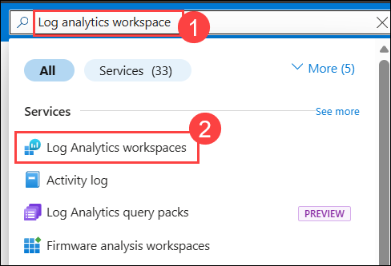

1. Click on + **Create** to create a new workspace.

   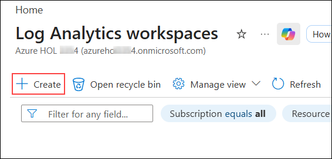
    
1. On the Create Log Analytics workspace page, add the below settings and click on **Review + Create (4)**.

   | Setting | Value|
   |----------|--------|
   | Resource Group | **hybrid-rg (1)**|
   | Name | **log-analytics<inject key="DeploymentID" enableCopy="false"/> (2)**|
   | Region | **East US (3)**|

   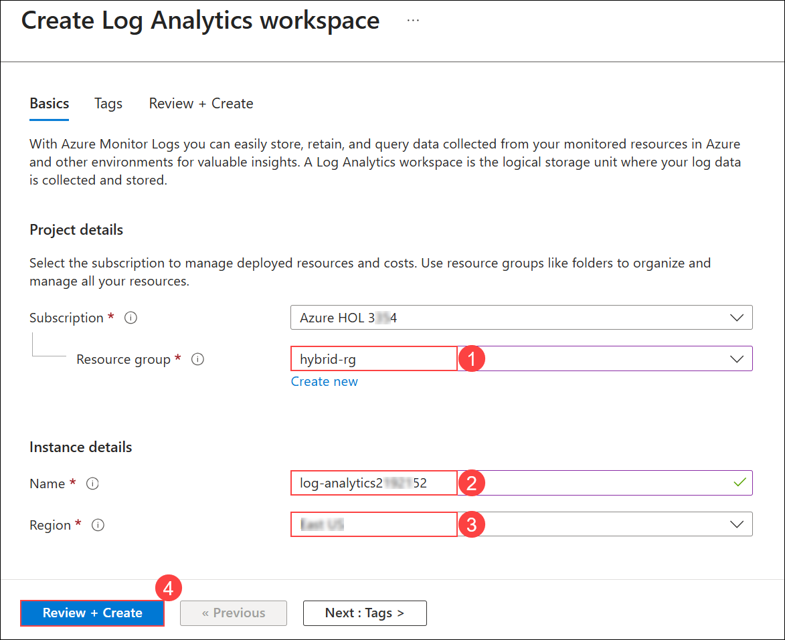

1. Once the workspace validation has passed, select **Create**. Wait for the new workspace to be provisioned, this may take a few minutes.

   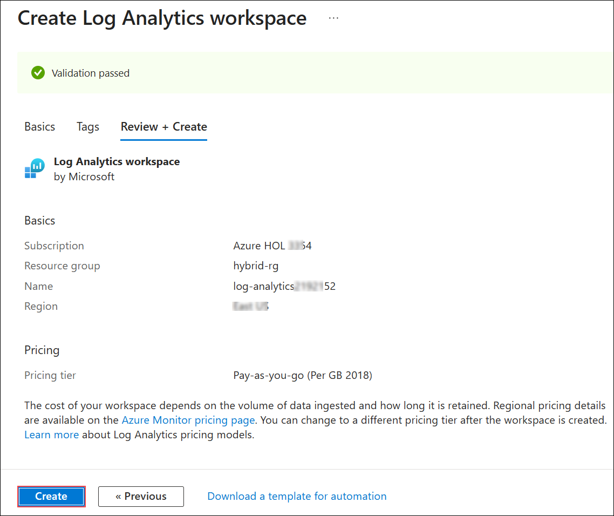

    > **Congratulations** on completing the task! Now, it's time to validate it. Here are the steps
    > - Scroll down in the lab guide and hit the Validate button for the corresponding task. If you receive a success message, you can proceed to the next task. 
    > - If not, carefully read the error message and retry the step, following the instructions in the lab guide.
    > - If you need any assistance, please contact us at cloudlabs-support@spektrasystems.com. We are available 24/7 to help you out.

    <validation step="abc96da1-739e-47e8-a627-b36299a4f02b" />

### Task 2: Add Diagnostic setting to collect audit and signin logs

In this task, you will configure diagnostic settings on log analytics workspace to collect audit and sign-in logs.

1. In the search bar, enter **Microsoft Entra ID (1)**, and then select **Microsoft Entra ID (2)**.

   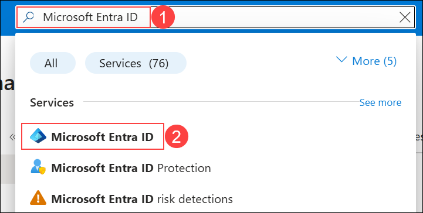

1. From the left navigation pane, select **Diagnostic settings** under Monitoring section.

   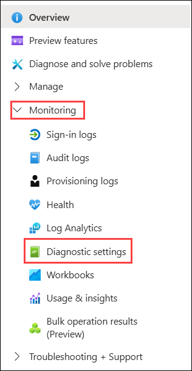

1. In the **Diagnostic settings | General** tab, click on **+ Add diagnistic setting**.

   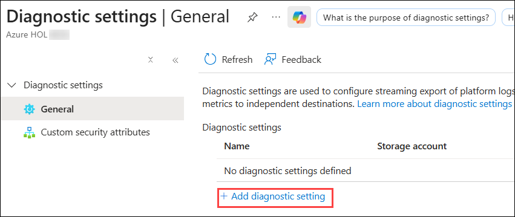

1. Enter the following details:

   - Diagnostic setting name : **Logsinfo (1)**
   - Check the box for **Auditlogs (2)** and **SignInLogs (3)**.
   - Under **Destination details**, select the **Send to Log analytics checkbox (4)** and make sure that the log analytics workspace that was created earlier is selected **(5)**.
   - Click on **Save (6)**.

      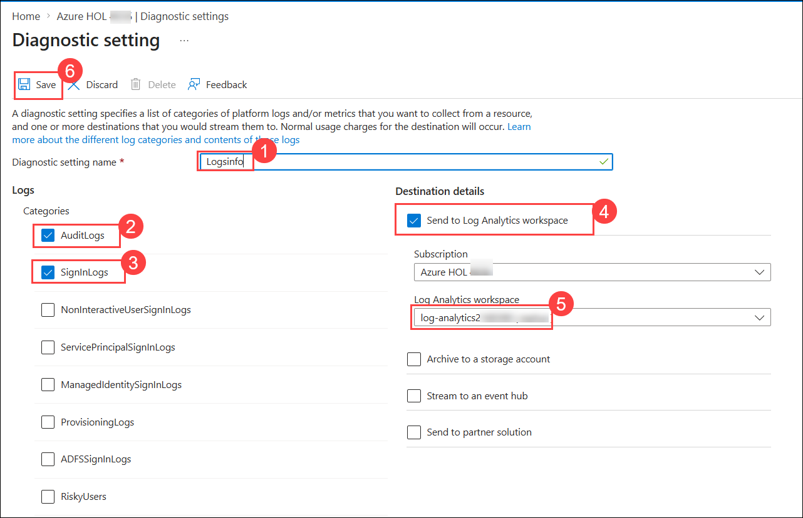

1. Once it is saved, open a New InPrivate window in Microsoft Edge and navigate to the Azure portal page using the following URL:

    ```
    https://portal.azure.com/
    ```

1. On the **Sign in** blade, you will see a login screen, in which enter the following email/username and password and then click on **Sign in**.  

   * **Azure Username/Email**:  <inject key="AzureAdUserEmail"></inject> 

         

   * **Temperory Access Pass**:  <inject key="AzureAdUserPassword"></inject>
  
        
  
1. If you see the pop-up **Stay Signed in?** click **No**.

1. Once it is logged into Azure portal successfully, close the InPrivate window.

   >**Note**: Wait for about 15 mins for logs ingestion to happen and proceed with the next task.

### Task 3: Verify the logs in the workspace

In this task, you will verify the logs collected in the Log Analytics workspace.

1. In the Search bar of the Azure portal, type **Log Analytics workspace (1)**, then select **Log Analytics workspaces (2)**. Select the newly created workspace.

   

1. On the **Log Analytics workspaces** page, select **log-analytics<inject key="DeploymentID" enableCopy="false"/>**.

   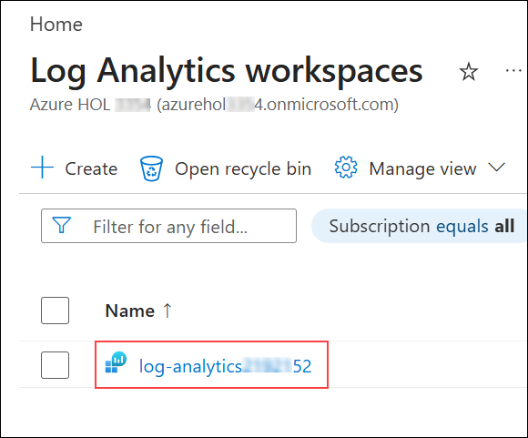

1. In the **Log Analytics workspace**, select **Logs (1)**, and then close any pop-up by selecting **Cancel (2)**.

   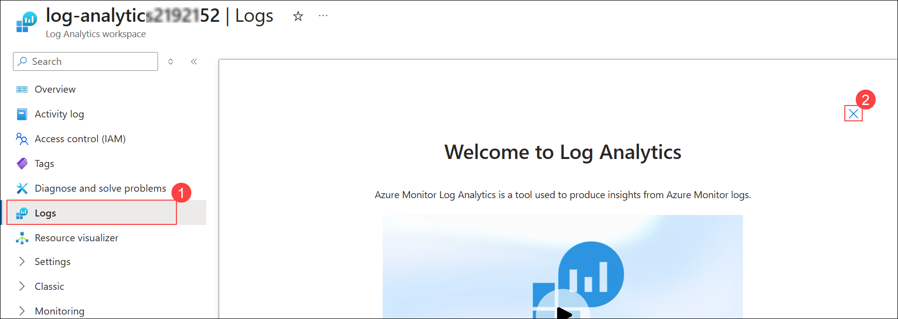

1. In the **Logs** pane, select the dropdown next to **Simple mode (1)**, and then select **KQL mode (2)**.

   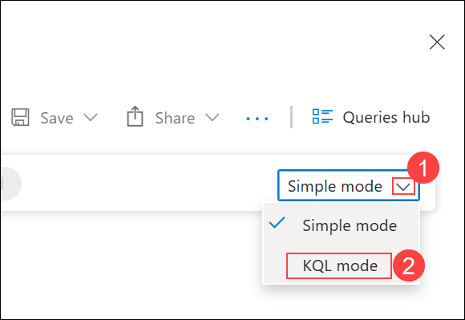

1. In the query editor, enter the following query **AuditLogs (1)**, and then select **Run (2)**:

   ```
      AuditLogs
   ```
      
   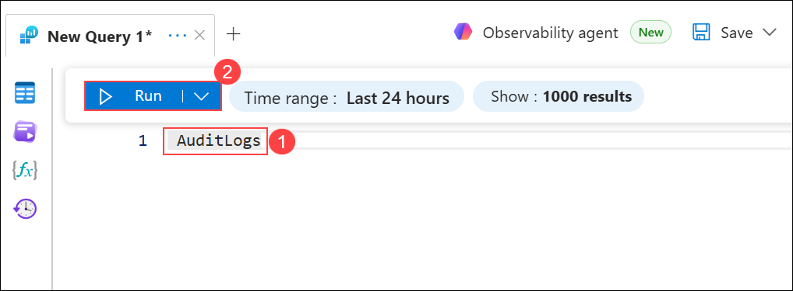

   ```
   SigninLogs
   ```
   
   

   > **Note:** It may take 15–20 minutes for logs to appear in the workspace after ingestion.

## Summary

In this lab, you have successfully created a Log Analytics workspace, configured diagnostic settings to collect audit and sign-in logs from Microsoft Entra ID, and verified the logs in the workspace. This setup is crucial for monitoring and auditing activities in your Azure environment, helping you maintain security and compliance effectively.

#### You have successfully completed the lab. Click on Next >> to proceed with the next lab.

   
